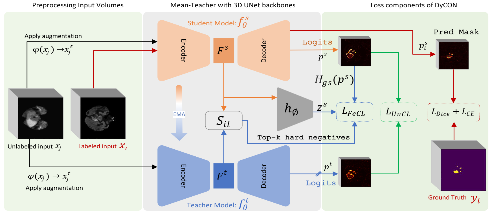

# DyCON: Dynamic Uncertainty-aware Consistency and Contrastive Learning for Semi-supervised Medical Image Segmentation



**Paper:** [DyCON: Dynamic Uncertainty-aware Consistency and Contrastive Learning for Semi-supervised Medical Image Segmentation](https://dycon25.github.io/)

**Authors:** [Maregu Assefa](https://scholar.google.com/citations?user=XR6wzDQAAAAJ&hl=en), [Muzammal Naseer](https://muzammal-naseer.com/), [Iyyakutti Iyappan Ganapathi](https://scholar.google.com/citations?user=TMpGqLEAAAAJ&hl=en&oi=ao), [Syed Sadaf Ali](https://scholar.google.com/citations?user=K6GEpXUAAAAJ&hl=en), [Mohamed L Seghier](https://www.ku.ac.ae/college-people/mohamed-seghier), [Naoufel Werghi](https://naoufelwerghi.com/)

---

## Abstract

Semi-supervised medical image segmentation often suffers from class imbalance and high uncertainty due to pathology variability. We propose **DyCON**, a dynamic uncertainty-aware consistency and contrastive learning framework that addresses these challenges via two novel losses: UnCL and FeCL. UnCL adaptively weights voxel-wise consistency based on uncertainty, while FeCL improves local feature discrimination under imbalance by applying dual focal mechanisms and adaptive entropy-based weighting to contrastive learning.

---

## Requirements

- **OS:** Ubuntu 22.04.4 LTS
- **Python:** 3.8.0
- **PyTorch:** 2.1.0
- **CUDA:** 12.5
- **GPU:** NVIDIA A100-SXM4-80GB (hoặc tương đương)

Cài đặt môi trường bằng lệnh:
```bash
conda env create -f requirements.yml
conda activate <your_env_name>
```

---

## Dataset Preparation

### 1. Download Datasets

- **BraTS-2019:**  
  Tải từ [Kaggle](https://www.kaggle.com/datasets/aryashah2k/brain-tumor-segmentation-brats-2019/data)
- **PancreasCT:**  
  Tải từ [Google Drive](https://drive.google.com/drive/folders/1kQX8z34kF62ZF_1-DqFpIosB4zDThvPz?usp=sharing)

### 2. Tổ chức thư mục

Tạo hai thư mục:
```
data/BraTS2019/
data/Pancreas/
```

Giải nén dữ liệu vào các thư mục tương ứng.  
Ví dụ cho BraTS-2019:
```
data/BraTS2019/MICCAI_BraTS_2019_Data_Training/
├── HGG/
├── LGG/
├── name_mapping.csv
├── survival_data.csv
```

### 3. Chuyển đổi định dạng dữ liệu

Dữ liệu BraTS-2019 ban đầu ở định dạng raw, cần chuyển sang định dạng hd5:
```bash
cd data/BraTS2019
python convert_raw_to_hd5.py
```
Lệnh này sẽ merge và chuyển đổi tất cả các file về đúng định dạng training.

---

## Usage

### Training

Chuyển vào thư mục code và chạy script:
```bash
cd code/
./run_brats19.sh    # Train trên BraTS-2019
./run_Panc.sh       # Train trên PancreasCT
```

### Evaluation

```bash
python test_BraTS19.py --labelnum 25     # Đánh giá trên BraTS-2019
python test_Pancreas.py --labelnum 12    # Đánh giá trên PancreasCT
```

---

## Citation

Nếu bạn thấy dự án hữu ích, vui lòng star repository và trích dẫn như sau:
```bibtex
@InProceedings{assefa2025dycon,
  title={DyCON: Dynamic Uncertainty-aware Consistency and Contrastive Learning for Semi-supervised Medical Image Segmentation},
  author={Maregu Assefa, Muzammal Naseer, Iyyakutti Iyappan Ganapathi, Syed Sadaf Ali, Mohamed L Seghier, Naoufel Werghi},
  booktitle={Proceedings of the IEEE/CVF Conference on Computer Vision and Pattern Recognition (CVPR)},
  year={2025}
}
```

---

## Contact

Mọi thắc mắc kỹ thuật, vui lòng liên hệ:  
**Email:** maregu.habtie@ku.ac.ae

---

## Acknowledgements

Mã nguồn dựa trên [SSL4MIS](https://github.com/HiLab-git/SSL4MIS). Xin cảm ơn các tác giả vì những đóng góp giá trị.
